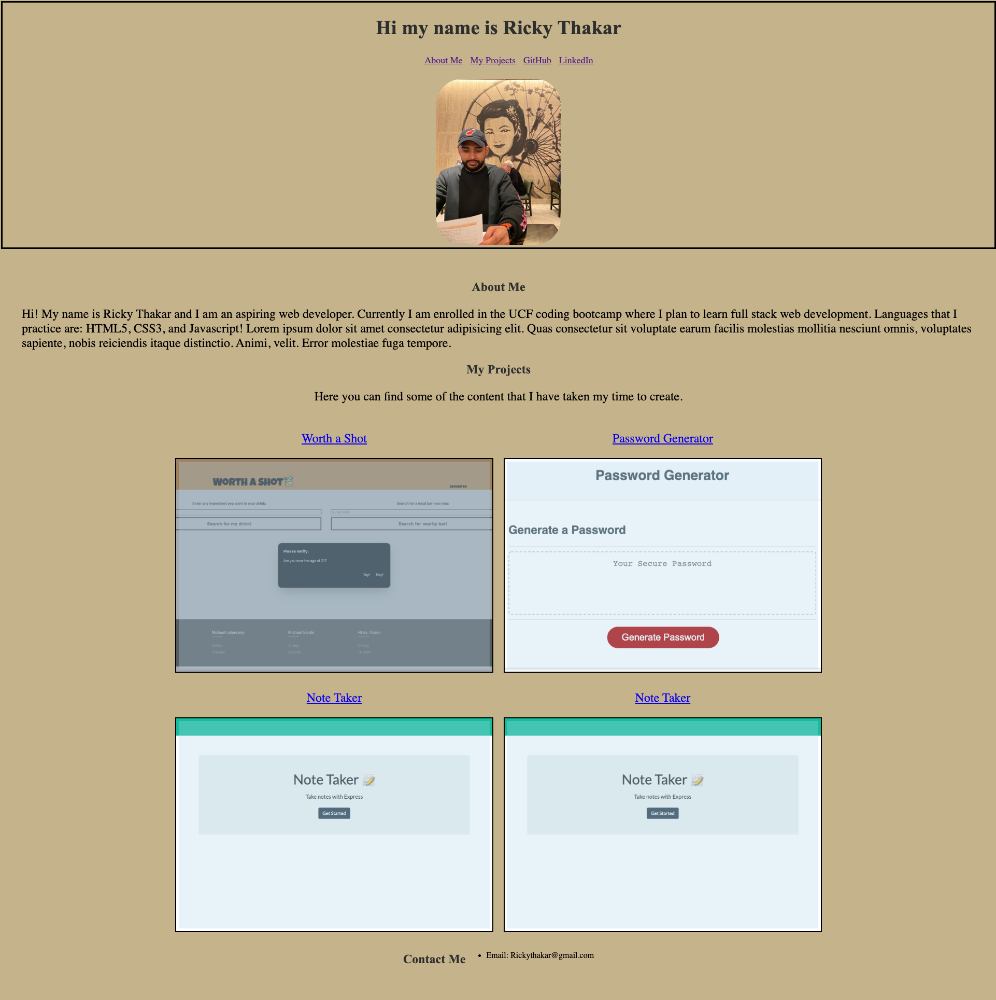

# Personal-Portfolio
My first personal portfolio project for coding bootcamp 
This is my first portfolio for the coding bootcamp.
It will be updated through the course with projects that I complete and publish online.
The ground work of the portfolio is that it will have my name, a bio, my projects, and a contact me section along with a navigation bar that goes with it.
More information will be added and finishing touches are still pending for the project.
For now the layout is available and one of the projects that I have worked on is available on the creative content section.

Below is a link for my portfolio.
![Link] (https://rickythakar.github.io/professional-portfolio/)

A screenshot is also available for the project now

